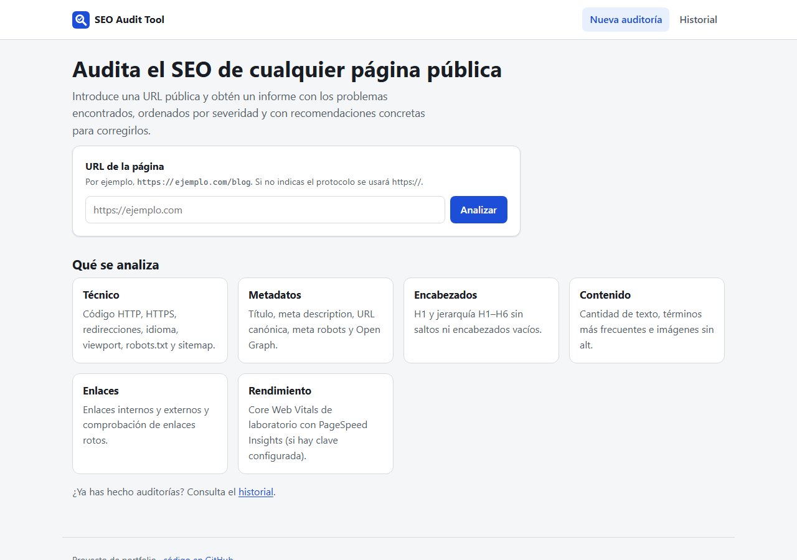
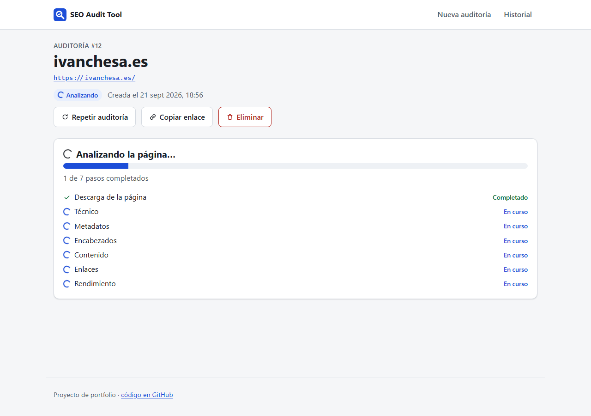
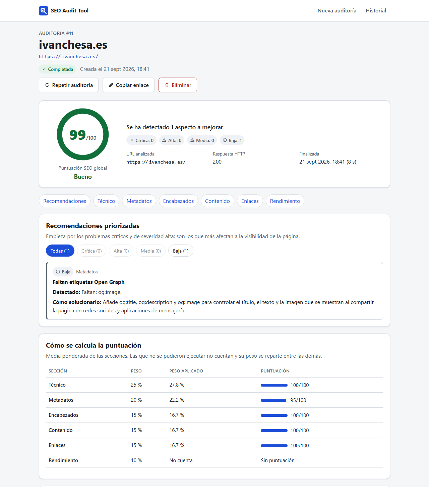
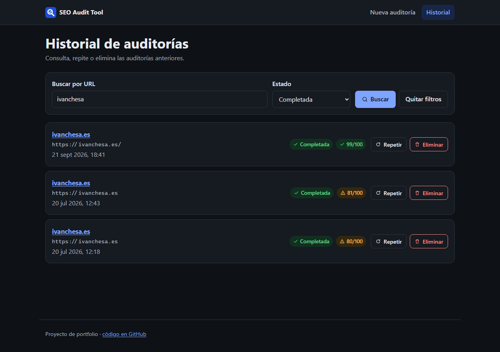
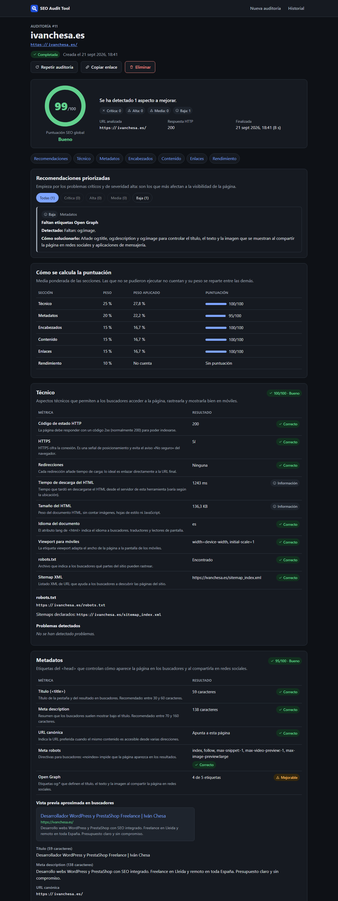
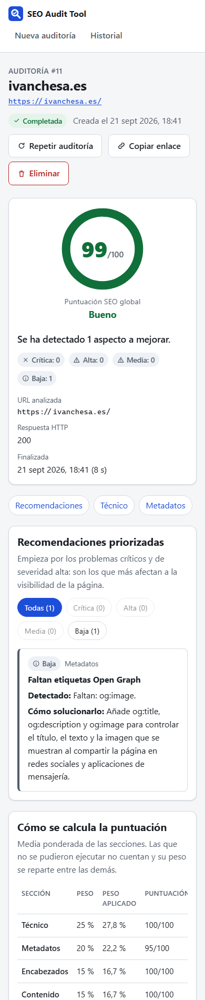
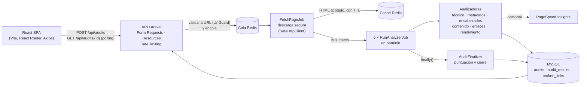

# SEO Audit Tool

[](https://github.com/IvanChesa/seo-audit-tool/actions/workflows/ci.yml)


[](LICENSE)

Aplicación full stack para **auditar el SEO on-page de cualquier página pública**. Introduces una URL, el
backend la descarga de forma segura en segundo plano, seis analizadores la revisan en paralelo y el
frontend muestra un informe con puntuación, problemas priorizados por severidad y una recomendación
concreta para cada uno.

> **Demo:** no hay una instancia pública desplegada. El proyecto se ejecuta en local con Docker
> (ver [Puesta en marcha](#puesta-en-marcha)).

**Qué demuestra este proyecto:** una API REST en Laravel con colas y *batches* de jobs idempotentes,
una defensa completa frente a SSRF (el servidor descarga URLs escritas por usuarios), análisis de HTML
probado con más de 300 tests, análisis estático a nivel 8 y una SPA en React accesible y responsive con
polling robusto y 78 tests.

## Índice

- [Capturas](#capturas)
- [Funcionalidades](#funcionalidades)
- [Qué se analiza](#qué-se-analiza)
- [Cómo se calcula la puntuación](#cómo-se-calcula-la-puntuación)
- [Arquitectura](#arquitectura)
- [Stack tecnológico](#stack-tecnológico)
- [Puesta en marcha](#puesta-en-marcha)
- [Configuración](#configuración)
- [Tests y calidad](#tests-y-calidad)
- [API](#api)
- [Seguridad](#seguridad)
- [Decisiones técnicas](#decisiones-técnicas)
- [Limitaciones conocidas](#limitaciones-conocidas)
- [Mejoras futuras](#mejoras-futuras)

## Capturas

Capturas reales de la aplicación auditando mi propia web.

| Inicio | Auditoría en curso |
| --- | --- |
|  |  |

| Informe | Historial (tema oscuro) |
| --- | --- |
|  |  |

<details>
<summary>Más capturas: informe completo en tema oscuro y versión móvil</summary>





</details>

## Funcionalidades

- **Auditoría en segundo plano**: la API responde al instante y el análisis se ejecuta en la cola.
- **Progreso real**: cada paso (descarga + seis análisis) informa de su estado; el frontend hace polling
  sin solapar peticiones y se detiene al terminar, al fallar o al salir de la página.
- **Informe detallado**: puntuación global y por sección, métricas explicadas, recomendaciones ordenadas
  por severidad (crítica, alta, media, baja) con la evidencia encontrada y cómo corregirlas.
- **Honesto con lo que no se ha medido**: si PageSpeed no está configurado o un análisis falla, el informe
  lo dice y esa sección no cuenta para la puntuación.
- **Historial** paginado con búsqueda por URL y filtro por estado (en la URL, así que se puede compartir),
  **repetir** y **eliminar** auditorías con confirmación.
- **Enlaces compartibles** para cada informe (`/audits/:id`).
- **Accesible y responsive**: navegación por teclado, foco visible, landmarks, textos alternativos,
  estados comunicados con icono + texto (nunca solo color), tema claro/oscuro y `prefers-reduced-motion`.

## Qué se analiza

| Sección | Comprobaciones | Peso |
| --- | --- | ---: |
| **Técnico** | Código HTTP, HTTPS, cadena de redirecciones, tiempo y tamaño del HTML, `lang` del documento, viewport móvil, `robots.txt` (incluido si bloquea la página) y sitemap XML | 25 % |
| **Metadatos** | `<title>` y meta description (presencia y longitud en caracteres), canonical, meta robots / `X-Robots-Tag` y Open Graph básico | 20 % |
| **Encabezados** | Número y contenido de los H1, jerarquía H1–H6 sin saltos, encabezados vacíos | 15 % |
| **Contenido** | Palabras del contenido principal, términos más frecuentes con su densidad (informativa) e imágenes sin `alt` | 15 % |
| **Enlaces** | Internos, externos y `nofollow`, enlaces sin texto y comprobación de enlaces rotos (máx. 30 por auditoría, 5 en paralelo) | 15 % |
| **Rendimiento** | Puntuación de Lighthouse y métricas de laboratorio (LCP, CLS, FCP, TBT, Speed Index) vía PageSpeed Insights, **solo si hay API key** | 10 % |

Cada problema detectado incluye un código, su severidad, la evidencia (por ejemplo, «El título tiene 78
caracteres») y una recomendación concreta. La densidad de palabras clave se muestra como dato orientativo:
solo se avisa de una repetición evidente (> 5 % en textos de al menos 200 palabras), porque la densidad no
es un factor de posicionamiento por sí misma.

## Cómo se calcula la puntuación

1. **Puntuación de sección** = 100 − penalizaciones de sus problemas: crítica −40, alta −20, media −10,
   baja −5 (mínimo 0). Rendimiento usa directamente la puntuación de Lighthouse.
2. **Puntuación global** = media ponderada de las secciones que obtuvieron puntuación, con los pesos de la
   tabla anterior. Las secciones omitidas (PageSpeed sin clave) o fallidas no cuentan y su peso se reparte
   proporcionalmente entre las demás; el informe muestra el peso aplicado a cada una.
3. **Límite por problema crítico**: los problemas críticos son los que impiden que la página aparezca en
   buscadores (`noindex` o bloqueo en `robots.txt`). Si hay alguno, la puntuación global no supera **49**.
4. **Valoración** con los mismos rangos que Lighthouse: 90–100 *Bueno*, 50–89 *Mejorable*, 0–49 *Deficiente*.

La lógica está en [`ScoreCalculator`](app/Analysis/ScoreCalculator.php) y los pesos en el enum
[`Section`](app/Enums/Section.php), ambos con tests unitarios.

## Arquitectura

```text
React → API Laravel → cola → analizadores → base de datos
```



Todo es **una sola aplicación Laravel**. Cualquier ruta fuera de `/api` y `/up` devuelve la vista
[`app.blade.php`](resources/views/app.blade.php), que carga la SPA con Vite; React Router decide qué
página mostrar y la SPA llama a `/api` en el mismo origen, así que no necesita CORS.

**Ciclo de vida de una auditoría**: `pending → processing → completed | failed`. Las transiciones se
aplican con un *compare-and-set* en una sola sentencia `UPDATE`, así que dos workers no pueden cerrar (ni
reabrir) la misma auditoría.

1. `POST /api/audits` valida y normaliza la URL, crea la auditoría (`pending`) y encola `FetchPageJob`.
2. `FetchPageJob` la pasa a `processing`, descarga la página con todas las protecciones anti-SSRF y guarda
   el HTML en caché (máx. 2 MB, TTL de 60 min). Los errores transitorios (timeout, 5xx) se reintentan con
   espera creciente; los permanentes (404, no es HTML, redirección insegura…) cierran la auditoría con un
   motivo comprensible.
3. Se lanza un *batch* con un `RunAnalyzerJob` por sección. Cada resultado se guarda con *upsert* sobre un
   índice único `(audit_id, type)`: un reintento sustituye su resultado en lugar de duplicarlo. Un análisis
   que falla tras sus reintentos queda como «fallido» sin cancelar los demás (`allowFailures`).
4. Cuando termina el batch, `AuditFinalizer` (con bloqueo de fila) completa las secciones que no informaron,
   calcula la puntuación, cierra la auditoría y borra el HTML de la caché.
5. `audits:prune` (cada hora) marca como fallidas las auditorías atascadas y, si se configura, elimina el
   historial antiguo.

### Estructura del repositorio

```text
seo-audit-tool/
├── app/
│   ├── Security/                UrlNormalizer, UrlGuard, IpAddressPolicy, SafeHttpClient (anti-SSRF)
│   ├── Analysis/                Analizadores, puntuación, descarga, informe y finalizador
│   ├── Jobs/                    FetchPageJob y RunAnalyzerJob
│   ├── Http/                    Controlador, Form Requests, Resources y middleware
│   └── Console/Commands/        audits:prune
├── config/seo-audit.php         Límites y parámetros de la auditoría
├── routes/                      api.php (API), web.php (devuelve la SPA) y console.php
├── resources/
│   ├── views/app.blade.php      Página HTML que carga la SPA
│   ├── css/app.css              Estilos
│   └── js/                      SPA React (cada test junto a su archivo)
│       ├── api/                 Cliente Axios, servicios y mapeo de errores
│       ├── hooks/               useAudit (polling), useDocumentTitle
│       ├── pages/               Inicio, auditoría, historial y 404
│       ├── components/          Informe, formulario, progreso y componentes de UI
│       └── lib/                 Validación de URL, formato, etiquetas y textos de ayuda
├── tests/                       Unit y Feature (PHPUnit)
├── compose.yaml                 Entorno Docker (Laravel Sail)
├── vite.config.js               Vite, plugin de Laravel y Vitest
├── docs/screenshots/            Capturas del README
└── .github/workflows/ci.yml     Integración continua
```

## Stack tecnológico

| Capa | Tecnologías |
| --- | --- |
| Backend | PHP 8.4+, Laravel 13, colas y *job batching*, Eloquent, Symfony DomCrawler, cliente HTTP de Laravel (Guzzle + cURL) |
| Datos | MySQL 8.4 (SQLite en memoria para los tests), Redis para cola y caché |
| Frontend | React 19, Vite 8 con `laravel-vite-plugin`, React Router 7, Axios y Recharts (cargado bajo demanda) |
| Calidad | PHPUnit, Larastan (PHPStan nivel 8), Laravel Pint, Vitest, Testing Library, oxlint (con jsx-a11y) y Prettier |
| Entorno | Docker con Laravel Sail y GitHub Actions |

## Puesta en marcha

### Requisitos

- **Docker** (Docker Desktop en Windows/macOS). En Windows, ejecuta los comandos de Sail desde **WSL 2**;
  npm funciona tanto en WSL como en PowerShell (usa el mismo para `npm ci` y `npm run dev`).
- **Node.js 20.19 o superior** y npm para compilar el frontend.
- No hace falta tener PHP ni Composer instalados: se usan desde contenedores.

Todos los comandos se ejecutan desde la raíz del proyecto.

### 1. Instalación (solo la primera vez)

```bash
git clone https://github.com/IvanChesa/seo-audit-tool.git
cd seo-audit-tool
cp .env.example .env

# Dependencias PHP con un contenedor temporal (no requiere PHP local)
docker run --rm -u "$(id -u):$(id -g)" -v "$(pwd):/var/www/html" -w /var/www/html \
    laravelsail/php84-composer:latest composer install --ignore-platform-reqs

./vendor/bin/sail up -d                 # la primera vez construye la imagen (unos minutos)
./vendor/bin/sail artisan key:generate
./vendor/bin/sail artisan migrate
npm ci
```

> Si ya tienes PHP 8.4 y Composer en local, puedes sustituir el `docker run …` por `composer install`.

### 2. Arrancar

```bash
./vendor/bin/sail up -d     # aplicación, worker, scheduler, MySQL y Redis
npm run dev                 # Vite con recarga en caliente
```

La aplicación queda en <http://localhost>, con la API bajo `/api` y el estado de salud en
<http://localhost/up>.

`sail up -d` arranca cinco contenedores: `laravel.test` (la aplicación), `queue` (worker que procesa las
auditorías), `scheduler` (tareas programadas), `mysql` y `redis`. `npm run dev` levanta el servidor de
Vite; Laravel lo detecta (fichero `public/hot`) y carga el JavaScript desde él. Sin `npm run dev`, Laravel
sirve la última versión compilada con `npm run build` (en `public/build`).

> Si el puerto 80 está ocupado, define `APP_PORT=8080` en `.env` y abre <http://localhost:8080>.
> Si la página sale en blanco después de cerrar `npm run dev` a la fuerza, borra `public/hot` (Vite lo
> elimina al salir con normalidad).

### Workers y tareas programadas

Con Sail no hay que hacer nada más: los servicios `queue` y `scheduler` se reinician solos si se detienen.

```bash
./vendor/bin/sail logs -f queue          # ver los jobs en tiempo real
./vendor/bin/sail restart queue          # obligatorio tras cambiar código de los jobs
./vendor/bin/sail artisan audits:prune   # ejecutar la limpieza manualmente
```

Sin Docker, los equivalentes son `php artisan queue:work` y `php artisan schedule:work` (en producción,
un supervisor para el worker y un cron que ejecute `php artisan schedule:run` cada minuto).

## Configuración

Todas las variables están documentadas en [`.env.example`](.env.example), que no contiene secretos. Las
más relevantes:

| Variable | Por defecto | Descripción |
| --- | --- | --- |
| `CORS_ALLOWED_ORIGINS` | *(vacía)* | Otros orígenes que pueden llamar a la API desde el navegador (separados por comas). La interfaz no lo necesita: se sirve desde el mismo origen. |
| `PAGESPEED_API_KEY` | *(vacía)* | Clave de [PageSpeed Insights](https://developers.google.com/speed/docs/insights/v5/get-started). Sin ella, la sección de rendimiento aparece como «no ejecutada» y no cuenta. |
| `PAGESPEED_STRATEGY` | `mobile` | `mobile` o `desktop`. |
| `AUDIT_MAX_PAGE_BYTES` | `2097152` | Tamaño máximo del HTML descargado (2 MB). |
| `AUDIT_FETCH_TIMEOUT` / `AUDIT_CONNECT_TIMEOUT` | `15` / `5` | Timeouts (segundos) de la descarga. |
| `AUDIT_MAX_REDIRECTS` | `5` | Redirecciones máximas, cada una validada de nuevo. |
| `AUDIT_ALLOWED_PORTS` | `80,443,8080,8443` | Puertos permitidos en las URLs. |
| `AUDIT_MAX_LINKS_CHECKED` / `AUDIT_LINK_CONCURRENCY` | `30` / `5` | Enlaces comprobados por auditoría y peticiones simultáneas. |
| `AUDIT_RATE_LIMIT_PER_MINUTE` / `AUDIT_RATE_LIMIT_PER_DAY` | `10` / `200` | Auditorías que puede crear cada IP. |
| `API_RATE_LIMIT_PER_MINUTE` | `120` | Peticiones de lectura por IP. |
| `AUDIT_STALE_AFTER_MINUTES` | `15` | Tras este tiempo sin terminar, una auditoría se marca como fallida. |
| `AUDIT_RETENTION_DAYS` | `0` | Días que se conserva el historial (`0` = siempre). |
| `REDIS_QUEUE_RETRY_AFTER` | `300` | Debe ser mayor que el timeout del job más largo (150 s). |

## Tests y calidad

Todo se ejecuta desde la raíz del proyecto:

| | Backend | Frontend |
| --- | --- | --- |
| Tests | `./vendor/bin/sail artisan test` — 308 tests | `npm test` — 78 tests |
| Estilo / formato | `./vendor/bin/sail composer lint` (Pint) | `npm run format:check` (Prettier) |
| Lint / análisis estático | `./vendor/bin/sail composer analyse` (Larastan nivel 8) | `npm run lint` (oxlint, falla con avisos) |
| Build | — | `npm run build` |
| Dependencias | `./vendor/bin/sail composer audit` | `npm audit` |

Los tests del backend usan SQLite en memoria, un DNS falso y `Http::preventStrayRequests()`, así que no
salen a Internet. Cubren, entre otros: normalización de URLs y más de 60 vectores SSRF, redirecciones
peligrosas, límites de tamaño, cada analizador con HTML real, puntuación, transiciones de estado,
reintentos e idempotencia de los jobs, la API completa (creación, validación, paginación, filtros,
eliminación en cascada, rate limiting, CORS), la ruta que sirve la SPA con sus cabeceras y un test de
extremo a extremo de la cola.

La **integración continua** ([`ci.yml`](.github/workflows/ci.yml)) ejecuta todo lo anterior en cada push
y pull request: backend con PHP 8.4 y 8.5 sobre SQLite y también contra MySQL 8.4, y frontend con lint,
formato, tests, build y auditoría de dependencias. No usa secretos. Dependabot propone actualizaciones
semanales.

## API

Base: `http://localhost/api`. Todas las respuestas son JSON; envía `Accept: application/json`.

| Método | Ruta | Descripción | Respuestas |
| --- | --- | --- | --- |
| `POST` | `/audits` | Crea una auditoría. Cuerpo: `{"url": "https://ejemplo.com"}` (se admite `ejemplo.com`). | `201` + cabecera `Location`, `422`, `429` |
| `GET` | `/audits` | Historial paginado. Parámetros: `page`, `per_page` (1–50), `status` (`pending`, `processing`, `completed`, `failed`), `search` (texto en la URL). | `200`, `422` |
| `GET` | `/audits/{id}` | Auditoría con progreso, secciones, problemas priorizados y desglose de la puntuación. | `200`, `404` |
| `DELETE` | `/audits/{id}` | Elimina la auditoría y sus resultados. | `204`, `404` |
| `GET` | `/up` | Estado de salud de la aplicación. | `200` |

```bash
curl -X POST http://localhost/api/audits \
     -H 'Content-Type: application/json' -H 'Accept: application/json' \
     -d '{"url": "https://ejemplo.com"}'
```

<details>
<summary>Ejemplo de respuesta de <code>GET /api/audits/{id}</code> (abreviada)</summary>

```json
{
  "data": {
    "id": 11,
    "url": "https://ivanchesa.es/",
    "status": "completed",
    "score": 99,
    "score_rating": "good",
    "http_status": 200,
    "error": null,
    "legacy": false,
    "progress": { "completed_steps": 7, "total_steps": 7, "percentage": 100, "steps": [
      { "key": "fetch", "label": "Descarga de la página", "status": "completed" }
    ] },
    "issues_summary": { "critical": 0, "high": 0, "medium": 0, "low": 1, "total": 1 },
    "issues": [
      {
        "section": "meta", "section_label": "Metadatos",
        "code": "incomplete_open_graph", "severity": "low",
        "title": "Faltan etiquetas Open Graph",
        "evidence": "Faltan: og:image.",
        "recommendation": "Añade og:title, og:description y og:image…"
      }
    ],
    "score_breakdown": { "weighted_average": 99, "critical_cap": 49, "critical_cap_applied": false, "sections": [
      { "key": "technical", "weight": 25, "effective_weight": 27.8, "score": 100, "counted": true }
    ] },
    "sections": [
      {
        "key": "technical", "label": "Técnico", "status": "completed", "score": 100,
        "data": { "checks": [ { "key": "https", "label": "HTTPS", "status": "pass", "value": "Sí" } ] },
        "issues": [], "error": null
      },
      {
        "key": "performance", "label": "Rendimiento", "status": "skipped", "score": null,
        "error": { "code": "pagespeed_not_configured", "message": "La medición de rendimiento no se ha ejecutado…" }
      }
    ]
  }
}
```

</details>

**Errores**: siempre `{"message": "…"}`, en español y sin detalles internos; las validaciones añaden
`errors` por campo (`{"errors": {"url": ["La URL apunta a una dirección IP privada…"]}}`). Las respuestas
limitadas (`429`) incluyen `Retry-After`.

## Seguridad

El servidor descarga URLs que escribe cualquiera y enlaces encontrados en páginas de terceros, así que la
defensa frente a **SSRF** es la pieza central. Todas las peticiones salientes (la página, cada redirección,
`robots.txt`, sitemaps y cada enlace comprobado) pasan por
[`UrlGuard`](app/Security/UrlGuard.php) y [`SafeHttpClient`](app/Security/Http/SafeHttpClient.php):

- **Solo `http` y `https`**; se rechazan credenciales en la URL (`usuario:clave@`), espacios, caracteres
  de control y barras invertidas (trucos para confundir a los parsers).
- **Puertos permitidos**: 80, 443, 8080 y 8443 (configurable).
- **Nombres locales bloqueados antes de resolver**: `localhost`, `*.localhost`, `*.local`, `*.internal`,
  `*.localdomain`, `home.arpa`, nombres sin dominio (servicios Docker como `mysql` o `redis`) y hosts de
  metadatos cloud (`metadata.google.internal`, `metadata.goog`).
- **Formas numéricas de IP no canónicas rechazadas** (`127.1`, `2130706433`, `0x7f000001`, `0177.0.0.1`).
- **Resolución DNS y validación de todas las IP** (A y AAAA): se bloquean loopback, redes privadas,
  link-local (incluido `169.254.169.254`), CGNAT (incluido `100.100.100.200`), rangos reservados, de
  documentación y *benchmarking*, multicast, broadcast, IPv6 ULA / link-local / site-local, IPv4 mapeada
  en IPv6, NAT64, 6to4, Teredo y el endpoint de Azure `168.63.129.16`. Basta con que un registro sea
  privado para rechazar el host. Se aplican una lista explícita y `FILTER_FLAG_GLOBAL_RANGE` de PHP.
- **DNS rebinding**: la conexión se fija a la IP validada con `CURLOPT_RESOLVE`, así que cURL no vuelve a
  resolver el nombre. Además, la URL se valida al crear la auditoría y otra vez justo antes de descargarla.
- **Redirecciones manuales**: nunca se siguen automáticamente; cada salto se valida y se fija a su IP
  (máximo 5, o 3 para enlaces).
- **Límites**: timeout de conexión y total, tamaño máximo que corta la transferencia aunque no haya
  `Content-Length` (el *sink* devuelve 0 bytes escritos y cURL aborta), solo cuerpos sin comprimir (evita
  «bombas» gzip), sin proxies del entorno y solo respuestas HTML para la página auditada.
- **HTML acotado en caché** con TTL y borrado explícito al terminar o eliminar la auditoría.

Otras medidas:

- **Rate limiting** por IP: 10 creaciones/minuto y 200/día; 120 lecturas/minuto.
- **CORS cerrado por defecto**: la interfaz se sirve desde el mismo origen y solo los orígenes de
  `CORS_ALLOWED_ORIGINS` pueden llamar a la API desde otro sitio, sin credenciales.
- **Errores sin información sensible**: mensajes genéricos para 404/405/500 (sin nombres de modelos ni
  trazas con `APP_DEBUG=false`); los detalles técnicos solo van al log.
- **Cabeceras de seguridad** en todas las respuestas (`nosniff`, `X-Frame-Options: DENY`,
  `Referrer-Policy: no-referrer`). La API usa la CSP `default-src 'none'`; la página de la SPA, una CSP
  que solo permite recursos del propio origen (sin scripts ni estilos en línea). Esa página no crea
  sesiones ni cookies.
- **Clave de PageSpeed en cabecera** (`X-Goog-Api-Key`), nunca en la URL, para que no acabe en logs.
- **Entradas validadas y normalizadas** con Form Requests; los filtros de búsqueda escapan los comodines
  de `LIKE`.
- **Sin secretos en Git**: `.env` ignorado; `.env.example` sin valores reales.
- En el frontend, React escapa todo el contenido remoto y los enlaces externos usan
  `rel="noopener noreferrer nofollow"`.

## Decisiones técnicas

- **Una sola aplicación Laravel para la API y la SPA**: se arranca con dos comandos, no hace falta CORS
  y ambas se despliegan juntas. La SPA solo habla con `/api`, así que se podría volver a separar sin
  tocar su código.
- **Un job por sección en un batch** en lugar de un único job: los análisis lentos (enlaces, PageSpeed) no
  bloquean a los rápidos, cada uno tiene su timeout y un fallo aislado no invalida la auditoría.
- **Analizadores como servicios puros** (`AuditContext → SectionResult`) inyectados por el contenedor:
  se prueban con HTML de ejemplo sin colas ni base de datos.
- **Idempotencia antes que reintentos «a ciegas»**: índice único + *upsert*, finalizador con bloqueo de
  fila y transiciones de estado atómicas, porque las colas garantizan «al menos una vez».
- **Migraciones nuevas en vez de reescribir las existentes**, para actualizar bases de datos ya creadas
  (limpiando los resultados duplicados que dejaban los reintentos antiguos). Las auditorías de la versión
  anterior se marcan como *legacy* en lugar de mostrar datos con otro formato.
- **La retención del historial es opcional** (`AUDIT_RETENTION_DAYS=0` por defecto): borrar datos del
  usuario automáticamente debe ser una decisión explícita.
- **Sin librerías de UI**: componentes propios con HTML semántico (`<dialog>` nativo para la
  confirmación). Recharts solo se carga cuando hay gráfica que mostrar.

## Limitaciones conocidas

- **Sin autenticación**: cualquiera con acceso a la API puede ver y borrar auditorías. Está pensado para
  uso local o como demo; en un despliegue público haría falta un sistema de usuarios.
- **Se analiza el HTML servido, sin ejecutar JavaScript**: en SPAs que renderizan en el cliente, el
  contenido puede no aparecer.
- **Se audita una única URL**, no el sitio completo; el sitemap solo se comprueba, no se rastrea.
- **Enlaces rotos**: se comprueban como máximo 30 por auditoría. Algunos servidores bloquean las
  peticiones automáticas (401, 403, 429); se muestran como «no verificables», no como rotos.
- El parser de `robots.txt` sigue RFC 9309 para Googlebot y `*`, pero no normaliza la codificación
  porcentual de las rutas.
- El tiempo de respuesta se mide desde el servidor de la herramienta, no desde el usuario.
- Las palabras vacías solo cubren español e inglés.
- **Rate limiting por IP**: detrás de un proxy inverso hay que configurar los *trusted proxies* de Laravel
  para que la IP del cliente sea la real.
- El rendimiento necesita una clave de PageSpeed Insights y está sujeto a su cuota.

## Mejoras futuras

- Usuarios y auditorías privadas (Laravel Sanctum).
- Renderizado con navegador *headless* para analizar páginas que dependen de JavaScript.
- Rastreo de varias páginas a partir del sitemap y comparación entre auditorías.
- Notificaciones en tiempo real (WebSockets con Laravel Reverb) en lugar de polling.
- Exportación del informe (PDF/CSV) y especificación OpenAPI de la API.
- Tests end-to-end con Playwright e imagen Docker de producción.

## Licencia

[MIT](LICENSE) © IvanChesa
